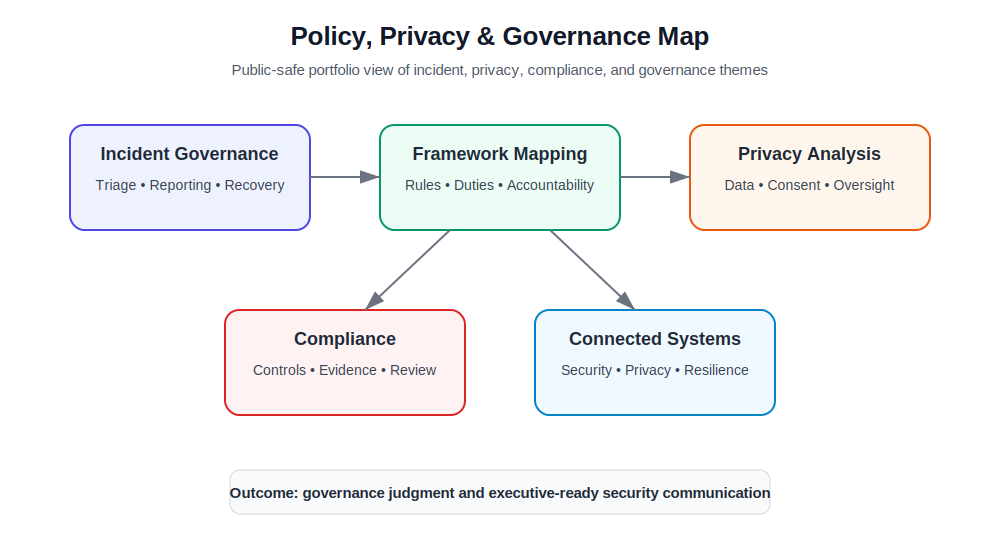
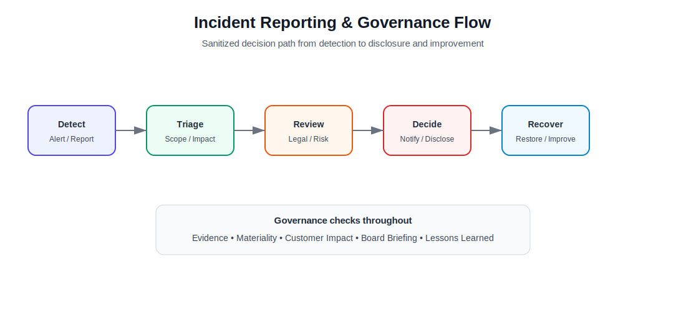

# Cyber Policy, Privacy & Incident Governance

A sanitized cybersecurity law, policy, privacy, and incident-governance portfolio project. This repository converts academic policy analysis into recruiter-friendly artifacts focused on legal accountability, breach response, privacy risk, critical infrastructure, and governance communication.

> **Disclaimer:** This is an academic/portfolio case study. It is not legal advice. It does not contain raw assignment PDFs, student identifiers, UIN, professor/course cover pages, private data, privileged information, or confidential legal analysis. Framework and case discussions are summarized for public GitHub presentation.

## What This Project Demonstrates

- Cybersecurity law and policy reasoning across incident response, privacy, surveillance, and critical infrastructure
- Comparison of governance frameworks such as NIST SP 800-53, FTC Act, CFAA, CIRCIA, SEC cyber disclosure rules, FISA Section 702, Fourth Amendment, GDPR, CCPA, HIPAA, FISMA, and IEEPA
- Incident-governance analysis using Target 2013, Colonial Pipeline, ransomware reporting, vendor access, and critical infrastructure resilience
- Privacy and ethics analysis involving spyware misuse, surveillance oversight, IoT data collection, and privacy-by-design
- Executive-facing communication around CISO liability, board reporting, transparency, and regulatory accountability
- Public-safe documentation practices for cybersecurity policy portfolios

## Repository Structure

```text
.
├── README.md
├── docs/
│   ├── executive-summary.md
│   ├── incident-governance.md
│   ├── privacy-and-ethics.md
│   ├── legal-framework-map.md
│   ├── nist-compliance-governance.md
│   ├── iot-privacy-security.md
│   ├── screenshot-guide.md
│   └── redaction-and-publication-checklist.md
├── data/
│   ├── framework-map.csv
│   └── case-study-matrix.csv
└── assets/
    ├── diagrams/
    │   ├── policy-governance-map.svg
    │   └── incident-reporting-flow.svg
    └── screenshots/
        └── README.md
```

## Quick Portfolio Narrative

This project shows how cybersecurity governance connects technical failures to legal exposure, consumer harm, national security concerns, privacy obligations, and executive accountability. It is designed for security analyst, GRC, privacy, policy, and cyber risk roles where writing, judgment, and risk translation matter.

Instead of uploading raw law assignments, this repo presents curated artifacts: incident-governance notes, legal framework mapping, privacy/ethics analysis, NIST/compliance discussion, IoT privacy assessment, and safe diagrams.

## Governance Map



## Incident Reporting Flow



## Portfolio Artifacts

| Artifact | Purpose |
|---|---|
| [`docs/executive-summary.md`](docs/executive-summary.md) | High-level summary of policy, privacy, legal, and governance themes. |
| [`docs/incident-governance.md`](docs/incident-governance.md) | Case-study analysis of breach response, critical infrastructure, reporting, and resilience. |
| [`docs/privacy-and-ethics.md`](docs/privacy-and-ethics.md) | Privacy, surveillance, spyware ethics, Fourth Amendment, and responsible technology discussion. |
| [`docs/legal-framework-map.md`](docs/legal-framework-map.md) | Maps laws and frameworks to cybersecurity accountability scenarios. |
| [`docs/nist-compliance-governance.md`](docs/nist-compliance-governance.md) | Explains NIST SP 800-53, compliance vs security, and governance maturity. |
| [`docs/iot-privacy-security.md`](docs/iot-privacy-security.md) | IoT cybersecurity and data privacy risk analysis. |
| [`docs/screenshot-guide.md`](docs/screenshot-guide.md) | Explains which screenshots/images are safe to use and where to place them. |
| [`docs/redaction-and-publication-checklist.md`](docs/redaction-and-publication-checklist.md) | Prevents accidental exposure of personal, academic, or sensitive information. |

## Main Topic Areas

| Area | What It Shows |
|---|---|
| Cyber incident governance | Breach response, reporting timelines, ransom-payment considerations, and incident transparency. |
| Privacy and ethics | Confidentiality, data protection, spyware accountability, surveillance oversight, and human-rights concerns. |
| Legal accountability | Difference between company accountability, individual unauthorized access, and executive/CISO risk. |
| Compliance governance | Why compliance is a baseline but not the same as effective security. |
| Critical infrastructure | MFA, VPN account lifecycle, segmentation, resilience, and supply-chain equipment risks. |
| IoT privacy/security | Weak defaults, patching constraints, privacy-by-design, cross-border data, and regulatory gaps. |

## Skills Demonstrated

`GRC` `Cyber Policy` `Privacy Analysis` `Incident Governance` `NIST 800-53` `FTC Act` `CFAA` `CIRCIA` `SEC Cyber Disclosure` `IoT Privacy` `Critical Infrastructure` `Executive Communication` `Security Writing`

## How I Would Explain This in an Interview

> I converted cybersecurity law and privacy coursework into a public-safe governance portfolio. I analyzed major cyber incidents, mapped legal and regulatory frameworks to security responsibilities, and documented how organizations should think about breach response, privacy risk, critical infrastructure resilience, executive accountability, and compliance beyond checkbox thinking.
