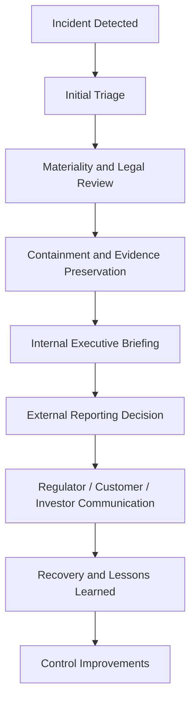

# Incident Governance

This document summarizes incident-governance lessons in a public-safe way. It focuses on response accountability, reporting, access control, resilience, and regulatory transparency.

## Case Study Themes

| Case Theme | Governance Issue | Security Control Direction | Business / Policy Impact |
|---|---|---|---|
| Retail data breach | Vendor access and weak segmentation increased exposure. | Vendor access review, network segmentation, alert triage, tokenization, IAM improvement. | Consumer harm, settlement exposure, brand trust impact. |
| Critical infrastructure ransomware | Inactive remote-access account, missing MFA, segmentation gaps, and continuity concerns. | MFA, VPN deprovisioning, IT/OT segmentation, backup testing, incident playbooks. | Operational shutdown, public-service impact, ransom-payment governance. |
| Incident reporting | Different rules apply depending on sector, materiality, and covered entity status. | Internal reporting matrix, legal escalation, evidence preservation, board-level updates. | Faster coordination, regulator transparency, investor/public trust. |
| Critical infrastructure supply chain | Foreign-manufactured or vendor-managed technology may create security and resilience concerns. | Procurement review, supplier security assessment, audit rights, inventory and lifecycle governance. | National-security, resilience, and compliance implications. |

## Incident Governance Lifecycle

## Practical Governance Controls

| Control Area | Recommended Governance Practice |
|---|---|
| Identity and Access | Enforce MFA, disable stale accounts, review vendor access, and document privileged access decisions. |
| Segmentation | Separate business IT, operational technology, vendor portals, and sensitive data environments. |
| Detection and Escalation | Define alert ownership, escalation thresholds, and follow-up evidence requirements. |
| Ransomware Readiness | Maintain offline backups, test recovery, define ransom-payment review, and preserve communications evidence. |
| Reporting | Maintain a matrix for internal, regulator, law-enforcement, customer, and board notification decisions. |
| Executive Communication | Brief leadership on operational impact, legal exposure, privacy impact, and recovery progress. |
| Lessons Learned | Convert incident findings into control improvements, audit items, and updated playbooks. |

## CISA vs SEC Reporting Lens

| Dimension | Critical Infrastructure Reporting Lens | Public Company Disclosure Lens |
|---|---|---|
| Primary purpose | National cyber visibility and coordinated response. | Investor protection and transparency. |
| Trigger | Significant covered cyber incident or ransom-payment context. | Material cybersecurity incident or cyber-risk governance disclosure need. |
| Audience | Federal cybersecurity coordination body. | Investors, regulators, and public market stakeholders. |
| Governance implication | Incident response must quickly identify whether reporting is required. | Cyber risk must be described in language that leadership and investors can understand. |

## Interview Talking Point

> I analyzed how cyber incidents create technical, legal, operational, and executive-governance consequences. The key lesson is that incident response is not only containment and recovery; it also includes legal escalation, communication, board visibility, evidence handling, and post-incident control improvement.
