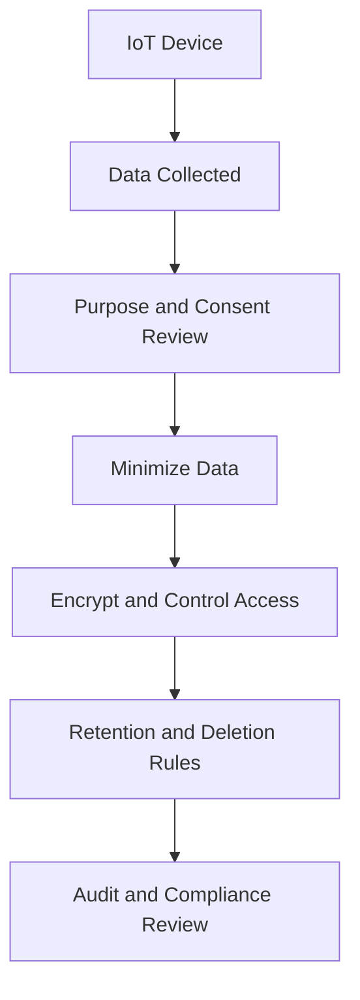

# IoT Privacy and Security

This document summarizes Internet of Things privacy and cybersecurity themes from the semester-paper source work in public-safe form.

## IoT Risk Overview

IoT environments create security and privacy challenges because devices are distributed, diverse, low-power, difficult to patch, and often connected to sensitive personal or operational environments.

## Risk Matrix

| Risk Theme | Security / Privacy Concern | Governance Response |
|---|---|---|
| Weak default configuration | Default passwords and insecure settings increase exposure. | Require secure defaults and onboarding checks. |
| Limited patching | Devices may remain vulnerable for long periods. | Require update mechanisms, lifecycle support, and vulnerability disclosure. |
| Data collection opacity | Users may not understand what is collected or shared. | Use clear notices, consent options, and data minimization. |
| Smart-home privacy | Cameras, speakers, and sensors may reveal intimate patterns. | Enforce access controls, encryption, local processing where possible, and retention limits. |
| Healthcare IoT | Wearables and medical devices collect sensitive health information. | Apply stronger authentication, encryption, audit logging, and privacy review. |
| Industrial IoT | Connected operational systems can affect safety and continuity. | Segment networks, monitor devices, and define recovery procedures. |
| Cross-border data transfers | Data may be processed across multiple legal jurisdictions. | Maintain data-flow maps and jurisdiction-specific compliance review. |
| Fragmented regulation | Different countries set different standards. | Use a baseline security/privacy standard across all markets. |

## IoT Privacy-by-Design Flow

## Governance Recommendations

1. Ban weak default credentials.
2. Require secure update mechanisms.
3. Publish clear vulnerability disclosure processes.
4. Maintain a data-flow inventory for device ecosystems.
5. Apply privacy-by-design during product development.
6. Use encryption for sensitive data in transit and at rest.
7. Segment IoT devices from high-value enterprise systems.
8. Create retention and deletion standards for collected data.
9. Review cross-border transfer requirements before deployment.
10. Document ownership for security and privacy decisions.

## Interview Talking Point

> I assessed IoT privacy and security as a governance problem, not only a device problem. The key risks were weak defaults, patching limitations, opaque data collection, sensitive health/home data, industrial dependency, and inconsistent regulation. I mapped those risks to privacy-by-design and security lifecycle controls.
