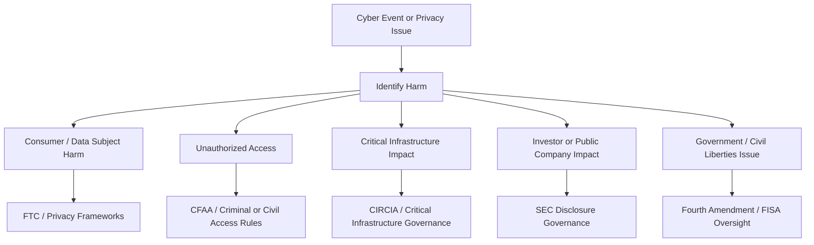

# Legal Framework Map

This document maps cybersecurity policy frameworks to the types of governance questions analyzed in the source work. It is a public-safe study artifact and not legal advice.

## Framework Matrix

| Framework / Topic | Primary Governance Focus | Example Cybersecurity Scenario | Portfolio Lesson |
|---|---|---|---|
| FTC Act | Consumer protection and unfair/deceptive business practices | Company fails to safeguard consumer data or overstates its security posture | Organizations must align security claims with actual controls. |
| CFAA | Unauthorized access and misuse of protected computers | Individual or group accesses systems without authorization | Legal analysis differs for external actors versus company security duties. |
| CIRCIA | Critical infrastructure cyber incident reporting | Covered entity experiences a significant cyber incident or ransom-payment event | Incident response needs a reporting decision process. |
| SEC cyber disclosure rules | Public-company cyber risk and incident disclosure | Material cyber incident affects investors or business operations | Cybersecurity is a board and investor-governance issue. |
| FISA Section 702 | Foreign intelligence collection and privacy safeguards | Foreign intelligence activity may incidentally collect protected information | National security programs require oversight and minimization. |
| Fourth Amendment | Limits on government search and seizure | Digital records, metadata, or device searches | Digital privacy requires clear scope and legal justification. |
| GDPR | Personal data protection and individual rights | Personal data collection, retention, and cross-border transfer | Privacy rights and data governance must be designed into systems. |
| CCPA | Consumer privacy rights and business data obligations | Consumer data collection and disclosure practices | Transparency and consumer control matter in privacy programs. |
| HIPAA | Health information privacy and security | Healthcare IoT and patient data | Sensitive health data requires stronger safeguards and access control. |
| FISMA / NIST | Federal security governance and control programs | Security control baselines and risk management | Controls should be tailored to risk, not treated as a checkbox exercise. |
| IEEPA / sanctions risk | Restricted transactions and national-security concerns | Payments or transactions involving restricted parties | Cyber incident response may require legal and finance escalation. |

## Accountability Map

## FTC vs CFAA Comparison

| Dimension | FTC Act Lens | CFAA Lens |
|---|---|---|
| Typical target | Companies and business practices | Unauthorized actors or misuse of access |
| Primary concern | Consumer harm, unfairness, deception, inadequate safeguards | Unauthorized access, damage, fraud, or misuse of protected systems |
| Common outcome | Consent orders, required security improvements, civil penalties, monitoring | Criminal prosecution, civil damages, fines, or other legal remedies |
| Security lesson | Organizations must maintain reasonable security and avoid misleading claims | Access authorization boundaries must be clear and enforceable |

## Governance Takeaway

A single incident can trigger multiple accountability paths. A ransomware incident, for example, may involve unauthorized access, extortion concerns, critical infrastructure reporting, business continuity, privacy notification, and executive disclosure obligations.

## Interview Talking Point

> I mapped different cybersecurity legal frameworks to the type of harm or obligation involved. This helped distinguish company accountability, unauthorized access, incident reporting, privacy rights, investor disclosure, and public-sector oversight.
