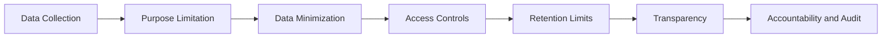

# Privacy and Ethics

This document summarizes privacy and ethics themes from the source work in public-safe form.

## Core Privacy Themes

| Theme | Governance Question | Practical Takeaway |
|---|---|---|
| Confidentiality | Who should have access to sensitive data? | Privacy is closely tied to access governance and data minimization. |
| Vendor risk | How should external partner access be controlled? | Vendor access should be scoped, monitored, reviewed, and segmented. |
| Sensitive technology use | How should powerful technology be governed? | Use should be limited by policy, oversight, documentation, and review. |
| Public-sector data access | How should public needs be balanced against individual privacy? | Oversight, minimization, defined scope, and accountability are central controls. |
| Digital evidence | How should digital information be accessed and retained? | Digital access requires clear purpose, proportionality, and privacy safeguards. |
| Public policy data | How can data integration support public benefit? | De-identification, audit trails, access control, transparency, and oversight are important. |

## Privacy-by-Design Model

## Ethical Evaluation Questions

1. Is the data collection necessary and proportionate?
2. Are users clearly informed about what is collected and why?
3. Can the user understand consent, retention, and deletion options?
4. Is sensitive data encrypted, segmented, and access-controlled?
5. Who owns oversight for sensitive technology use?
6. Are independent review or audit mechanisms in place?
7. Are retention limits and deletion obligations documented?
8. Are affected people, customers, or stakeholders clearly considered?

## Governance Approach

A strong privacy governance approach includes authorization standards, data minimization, internal audit controls, independent review, documented purpose and scope, transparency where appropriate, and clear accountability for data handling decisions.

## Interview Talking Point

> I evaluated privacy and ethics issues by asking who is affected, what data is collected, whether collection is necessary, how data is protected, and what oversight exists. This helped connect technical security decisions to human impact and governance accountability.
